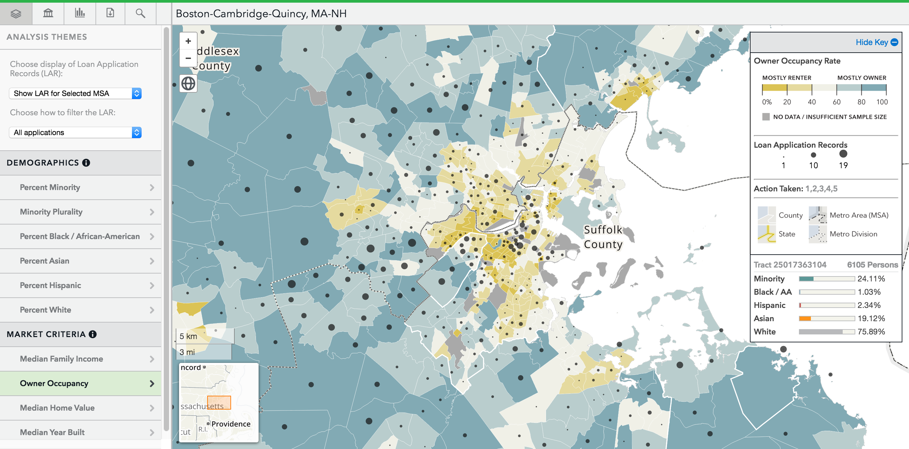

Mapusaurus [](https://travis-ci.org/cfpb/mapusaurus) [](https://coveralls.io/r/cfpb/mapusaurus)




## Description

This repository provides data and scripts to set up an API endpoint for serving Home Mortgage Disclosure Act data as well as front-end and back-end application components that feed off this data.
Financial institution data is loaded from raw HMDA files and welded to National Information Center data to allow for more robust analysis in the front-end application.

The Mapusaurus back-end is a Python/Django application. Additional requirements are defined below.


## Data

The data you can load is:

* HMDA Transmittal Sheet
* HMDA Reporter Panel

Both are available from the FFIEC.

Here are the 2013 files:

Transmittal sheet:
http://www.ffiec.gov/hmdarawdata/OTHER/2013HMDAInstitutionRecords.zip

Reporter panel:
http://www.ffiec.gov/hmdarawdata/OTHER/2013HMDAReporterPanel.zip

## Requirements

This currently uses:
Django 1.7
Python 2.7.x

You will also need:
PostgreSQL 9.3
PostGIS 2.1.x
ElasticSearch

There's also a requirements.txt file in the repository root directory that can be installed with pip.


## Loading the data


To create the tables, you need to run:

```
    python manage.py migrate respondents
```

There's also a fixture that you need to load some information from:

```
    python manage.py loaddata agency
```

This loads static regulator agency data.

Download the two transmittal sheet and reporter panel flat files.

There are two management commands that will load data, and need to be run
in the following order:

```
1. python manage.py load_transmittal <path/to/transmittal_sheet>
2. python manage.py load_reporter_panel <path/to/reporter_panel>
```


## GEO

The 'geo' application requires GeoDjango and PostGIS. Follow the instructions
for installing GeoDjango.

Here are some separate instructions for running the geo application.

```
    python manage.py migrate geo
```

Currently, we load census tract, county, CBSA, and metropolitan division files.
You can download them from the census.gov FTP site:

```
ftp://ftp2.census.gov/geo/tiger/TIGER2013/TRACT/
ftp://ftp2.census.gov/geo/tiger/TIGER2013/COUNTY/
ftp://ftp2.census.gov/geo/tiger/TIGER2013/CBSA/
ftp://ftp2.census.gov/geo/tiger/TIGER2013/METDIV/
```

This is how you load the data:

```
    # This example only loads census tracts from IL (FIPS code: 17); repeat
    # for other states as needed
    python manage.py load_geos_from /path/to/tl_2013_17_tract.shp
    python manage.py load_geos_from /path/to/tl_2013_us_county.shp
    python manage.py load_geos_from /path/to/tl_2013_us_cbsa.shp
    python manage.py load_geos_from /path/to/tl_2013_us_metdiv.shp
```

These import scripts are set up to update geos in place -- no need to delete
records manually.

Once census tracts and counties are loaded, run the following command to
associate census tracts with their CBSAs.

```
    python manage.py set_tract_csa_cbsa
```


## Census Data

The 'censusdata' app loads census data to the census tracts found in the 'geo'
application. As such, 'censusdata' relies on 'geo'.

First, run migrate to create the appropriate tables

```
    python manage.py migrate censusdata
```

You'll then want to import census data related to the tracts you've loaded
while setting up the 'geo' app. Go to
```
http://www2.census.gov/census_2010/04-Summary_File_1/
```
and select the state you care about. Download the associated `*.sf1.zip` file,
which you should then unzip.

Loading the data looks like this:
```
    python manage.py load_summary_one /path/to/XXgeo2010.sf1
```

Warning: currently, data will not be updated in place; to re-import, you'll
need to delete everything from the `censusdata_census2010*` tables.


## HMDA Data

The 'hmda' app loads HMDA data to the census tracts found in the 'geo'
application. As such, 'hmda' relies on 'geo'. In fact, 'hmda' will only store
data for states that are loaded via the 'geo' app.

First, run migrate to create the appropriate tables

```
    python manage.py migrate hmda
```

Next, download a flat file representing all of the HMDA LAR data:
```
http://www.ffiec.gov/hmda/hmdaflat.htm
```
and download the zip file. Unzip it and then:
```
    python manage.py load_hmda /path/to/2013HMDALAR\ -\ National.csv
```

Note that this process takes several minutes (though you will receive progress
notifications). This import can be run repeatedly (if additional geos are
added later, for example).

Warning: At the moment, the import assumes a single year of information.
That's a todo.

Alternatively, the load_hmda script can read a directory of CSV files and load them one by one.
There is also the option of removing these files after they are processed.

```
    split -l 50000 -d  "/path/to/2013HMDALAR\ -\ National.csv" hmda_csv_
    python manage.py load_hmda /path/to/2013HMDALAR/  delete_file:true
```


You will most likely want to pre-calculate the median number of loans for a
particular lender X city pair -- this speeds up map loading quite a bit.

```
    python manage.py calculate_loan_stats
```


## Styles

While the base application attempts to appear "acceptable", you will likely
wish to provide your own icons, colors, etc. We provide an example app
(`basestyle`) which you can modify directly or copy into a separate Django
app. If you go the latter route, remember to activate your new app and
deactivate the basestyle.
